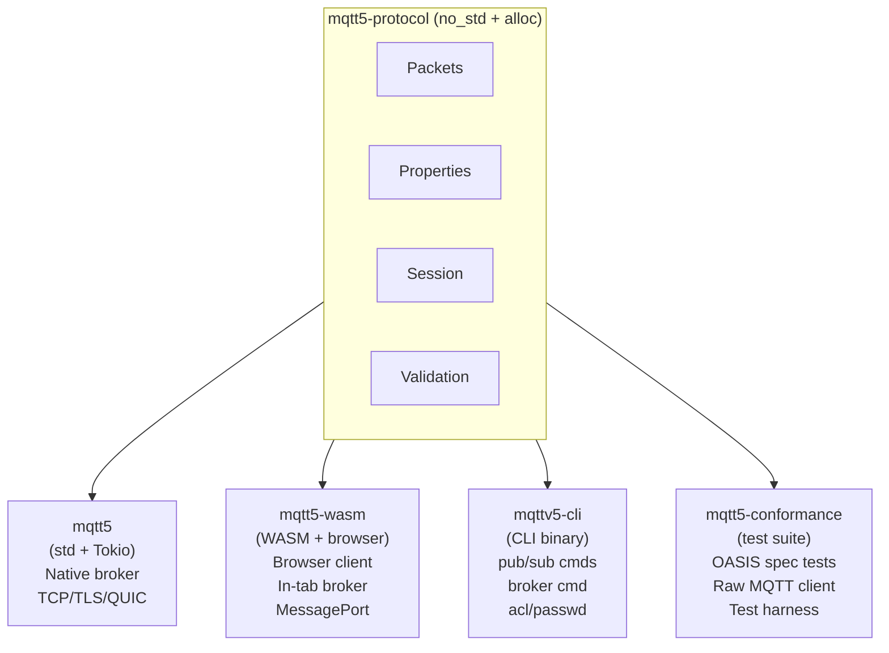
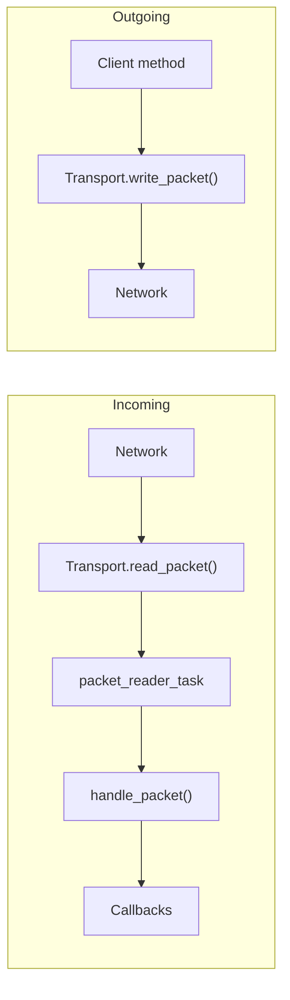
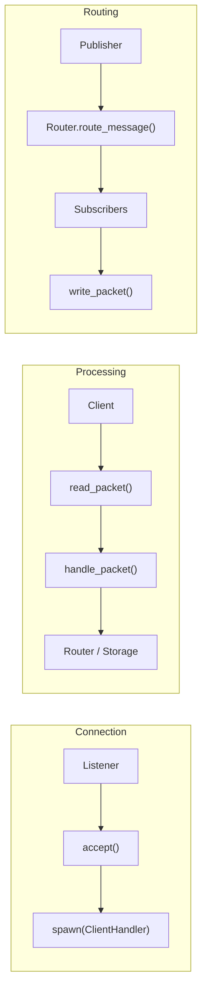
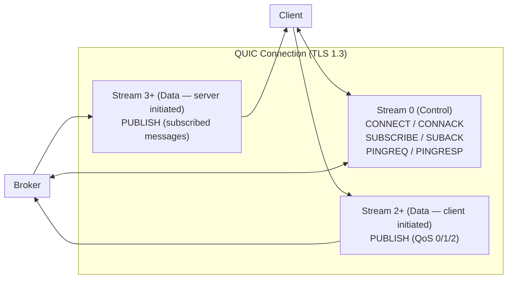
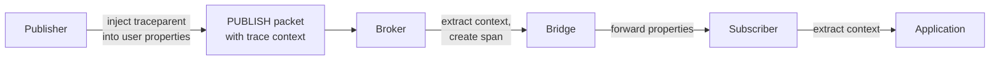

# MQTT v5.0 Platform Architecture

This document describes the architecture of the MQTT client library, broker implementation, and protocol crate.

## Crate Organization

Five crates provide platform-specific implementations sharing a common protocol core:



### mqtt5-protocol (Platform-Agnostic Core)

Platform-agnostic MQTT v5.0 protocol for native, WASM, and embedded targets. Supports `no_std` environments with `alloc`.

**Modules:**
- `packet/` - All MQTT v5.0 packet types (CONNECT, PUBLISH, SUBSCRIBE, etc.)
- `encoding/` - Binary encoding/decoding (variable integers, strings, binary data)
- `protocol/v5/` - Properties (with accessors and codec) and reason codes
- `session/` - Session management primitives:
  - `flow_control` - QoS flow control configuration and stats
  - `limits` - Connection limits and message expiry
  - `queue` - Message queue with priority and expiry
  - `subscription` - Subscription state management
  - `topic_alias` - Topic alias mapping
- `validation/` - Topic validation, namespace rules, shared subscription parsing
- `types/` - Core domain types (ConnectOptions, PublishOptions, QoS, Message, WillMessage)
- `bridge` - Bridge direction, topic mapping, and forwarding evaluation primitives
- `connection` - Connection state machine, reconnect config, connection events
- `topic_matching` - MQTT topic filter matching with wildcard support
- `error` / `error_classification` - Error types and recoverable error classification
- `keepalive` - Keepalive configuration and timeout calculation
- `flags` - CONNECT, CONNACK, PUBLISH flag parsing
- `constants` - Protocol constants
- `qos2` - QoS 2 state machine
- `packet_id` - Packet identifier management
- `numeric` - Safe numeric conversion utilities
- `transport` - Transport trait definition
- `time` - Platform-abstracted time (std, WASM web-time, embedded fallback)
- `prelude` - Alloc/std compatibility layer

**Features:**
| Feature | Description |
|---------|-------------|
| `std` (default) | Full std support with thiserror, tracing |

For single-core targets, use cfg: `rustflags = ["--cfg", "portable_atomic_unsafe_assume_single_core"]`

**Dependencies:** `bebytes`, `bytes`, `serde`, `hashbrown`, `portable-atomic`, `portable-atomic-util`

**Optional:** `thiserror` (std), `tracing` (std), `web-time` (WASM)

### mqtt5 (Native)

Full-featured async client and broker for Linux, macOS, Windows.

**Client Features:**
- `MqttClient` with automatic reconnection and exponential backoff
- QoS 0/1/2 with proper flow control
- TLS (rustls) with CA and client certificate support
- QUIC multistream for parallel operations
- Enhanced authentication (SCRAM-SHA-256, JWT, custom handlers)
- Connection event callbacks

**Broker Features:**
- Multi-transport: TCP, TLS, WebSocket, QUIC on different ports
- Authentication providers: password (argon2), certificate, JWT, federated JWT
- ACL system with wildcard topic matching
- Broker-to-broker bridging with loop prevention
- File-based and in-memory storage backends
- $SYS topics for statistics
- Session takeover semantics
- Optional OpenTelemetry integration
- Configuration hot-reload (file watching, SIGHUP-triggered via CLI)
- Echo suppression via configurable user property matching
- Payload codec support (gzip, deflate) behind feature flags

**Additional Modules:**
- `callback` - Subscription callback management and message dispatch
- `codec/` - Payload compression codecs (gzip, deflate) with `CodecRegistry`
- `crypto/` - TLS certificate verifiers (`NoVerification` restricted to `pub(crate)`)
- `tasks` - Background task management (packet reader, keepalive, reconnection)
- `types` - `ConnectOptions`, `ConnectionStats`, and related client types

**Session Module (extends protocol):**
- `flow_control` - Async flow control manager with Tokio semaphores
- `quic_flow` - QUIC stream flow registry
- `retained` - Retained message store
- `state` - Full session state with async support
- `subscription` - Subscription management
- `limits` - Connection limits

**Dependencies:** `tokio`, `rustls`, `tokio-tungstenite`, `quinn`

### mqtt5-wasm (WebAssembly)

Client and broker for browser environments. Published to npm as `mqtt5-wasm`.

```bash
npm install mqtt5-wasm
```

- `WasmMqttClient` with JavaScript Promise API (`Rc<RefCell<T>>` for client state)
- `WasmBroker` for in-browser testing (`Arc<RwLock<T>>` for broker state shared via Tokio)
- WebSocket, MessagePort, BroadcastChannel transports
- Optional payload codecs (gzip, deflate via `miniz_oxide`)

**Dependencies:** `wasm-bindgen`, `web-sys`, `js-sys`

### mqttv5-cli (Command-Line Tool)

Unified CLI for MQTT operations.

**Commands:**
- `mqttv5 pub` - Publish messages
- `mqttv5 sub` - Subscribe to topics
- `mqttv5 broker` - Run MQTT broker
- `mqttv5 acl` - Manage access control lists
- `mqttv5 passwd` - Manage password files
- `mqttv5 scram` - SCRAM credential management
- `mqttv5 bench` - Performance benchmarking

**Dependencies:** `clap`, `tokio`, `dialoguer`, `argon2`

### mqtt5-conformance (Specification Test Suite)

OASIS MQTT v5.0 specification conformance test suite. Not published to crates.io.

- `RawMqttClient` for byte-level packet control and protocol edge case testing
- Test harness with broker lifecycle management
- Manifest-driven test organization
- Report generation for conformance results

**Dependencies:** `mqtt5`, `mqtt5-protocol`, `tokio`

## Embedded Target Support

The protocol crate supports embedded targets via `no_std`:

| Target | Command | Notes |
|--------|---------|-------|
| Cortex-M4 (ARM) | `--target thumbv7em-none-eabihf` | Has hardware atomics |
| RISC-V (atomics) | `--target riscv32imac-unknown-none-elf` | Has atomic extension |
| ESP32-C3 | `--target riscv32imc-unknown-none-elf` | Configure single-core via .cargo/config.toml |

For single-core targets without hardware atomics, add to `.cargo/config.toml`:
```toml
[target.riscv32imc-unknown-none-elf]
rustflags = ["--cfg", "portable_atomic_unsafe_assume_single_core"]
```

Build commands:
```bash
cargo make embedded-cortex-m4   # ARM Cortex-M4
cargo make embedded-riscv       # RISC-V with atomics
cargo make embedded-verify      # All embedded targets
```

## Core Architectural Principle: Direct Async/Await

This library uses Rust's native async/await patterns throughout:

1. Tokio provides the async runtime (native)
2. Direct async calls are efficient and idiomatic
3. Code is simpler to debug than channel-based architectures

## Client Architecture

### Core Components

1. **MqttClient**: Main client struct
   - Holds shared state (transport, session, callbacks)
   - Direct async methods for all operations
   - `Arc<RwLock<T>>` for concurrent access

2. **Transport Layer**: Direct async I/O
   - `read_packet()` - async method for incoming packets
   - `write_packet()` - async method for outgoing packets
   - Implementations: TCP, TLS, WebSocket, QUIC

3. **Background Tasks**:
   - Packet reader: Continuously reads and dispatches packets
   - Keep-alive: Sends PINGREQ at intervals
   - Reconnection: Exponential backoff recovery

4. **TLS Configuration**:
   - Stored config for CA certs and client certificates
   - Applied automatically for `mqtts://` URLs
   - Supports AWS IoT ALPN

### Data Flow



### Error Handling

The client validates acknowledgment reason codes:
- PUBACK (QoS 1): Returns `MqttError::PublishFailed(reason_code)` on error
- PUBREC/PUBCOMP (QoS 2): Validates complete handshake
- Authorization: `ReasonCode::NotAuthorized` (0x87) from ACL failures

## Broker Architecture

### Core Components

1. **MqttBroker**: Main broker struct
   - Manages configuration and lifecycle
   - Spawns listening tasks per transport

2. **Server Listeners**: One per transport
   - TCP: Direct `accept()` loop
   - TLS: rustls wrapper with certificate validation
   - WebSocket: HTTP upgrade with tokio-tungstenite, path enforcement, Origin validation
   - QUIC: quinn endpoint with multistream

3. **ClientHandler**: Per-client connection
   - Direct async packet reading/writing
   - Manages client session state
   - Handles MQTT protocol

4. **MessageRouter**: Subscription matching
   - MQTT-compliant topic matching with wildcards (`+`, `#`)
   - System topic protection (`$SYS/#` excluded from `#`)
   - Shared subscription support (`$share/group/topic`)

5. **Storage Backend**: Persistence layer
   - Sessions, retained messages, queued messages, inflight messages
   - File-based (percent-encoded filenames, atomic writes with fsync) or in-memory implementations

### Broker Data Flow



### Authentication System

Pluggable providers via `AuthProvider` trait (`broker/auth/`):
- `AllowAllAuthProvider` - No authentication (development)
- `PasswordAuthProvider` - File-based with argon2 hashing (password fields excluded from logs)
- `CertificateAuthProvider` - TLS peer certificate fingerprint validation (64-char hex SHA-256)
- `ComprehensiveAuthProvider` - Combines password auth + ACL into one provider (primary broker auth provider)
- `CompositeAuthProvider` - Primary/fallback auth chain
- `RateLimitedAuthProvider` - Wraps any provider with rate limiting

Enhanced auth mechanisms (`broker/auth_mechanisms/`):
- `ScramSha256AuthProvider` - SCRAM-SHA-256 without channel binding (rejects concurrent auth for same client ID)
- `PlainAuthProvider` - PLAIN over TLS with pluggable credential store
- `JwtAuthProvider` - JWT token validation with `kid`-based verifier selection, mandatory `exp`/`sub` claims
- `FederatedJwtAuthProvider` - Multi-issuer JWT with JWKS auto-refresh and compiled regex claim patterns

Client-side auth handlers (`client/auth_handlers/`), implementing the `AuthHandler` trait (`handle_challenge`, `initial_response` -> `AuthResponse`):
- `ScramSha256AuthHandler` - SCRAM-SHA-256 client-side handshake
- `JwtAuthHandler` - JWT token-based authentication
- `PlainAuthHandler` - PLAIN authentication with optional authzid

Client abstraction:
- `MqttClientTrait` - Trait for mocking (`MockMqttClient` available for unit testing)

Session security:
- Sessions bound to authenticated `user_id` (rejects reconnection from different user)
- ACL re-checked on session restore (prunes unauthorized subscriptions)
- `NoVerification` TLS bypass restricted to `pub(crate)` scope

### ACL System

Rule-based access control:
- Wildcard topic matching in rules
- `%u` substitution expands to authenticated username in topic patterns (rejects usernames with `+`, `#`, `/`)
- Publish/subscribe permission separation
- Topic name validation on publish (after topic alias resolution)
- Role-based access control (RBAC)
- CLI management: `mqttv5 acl add/remove/list/check`
- Sender identity injection: broker stamps `x-mqtt-sender` (authenticated user_id) and `x-mqtt-client-id` (publisher's MQTT client_id, anti-spoof stripped) user properties on PUBLISH packets

### Bridge Manager

Broker-to-broker connections:
- Each bridge is a client to remote broker
- Topic mappings with prefix transformation
- Loop prevention via bridge headers
- TLS/mTLS support with AWS IoT integration
- Exponential backoff reconnection

### Load Balancer (Server Redirect)

The broker can act as a pure connection redirector for horizontal scaling. When `load_balancer` is configured, the broker never handles MQTT traffic — it only redirects clients to a backend.

On each CONNECT, the broker hashes the client ID (byte-sum modulo backend count) to deterministically select a backend. It responds with a CONNACK containing reason code `UseAnotherServer` (0x9C) and a `ServerReference` property set to the backend URL. The client parses the URL and reconnects directly to the backend.

The client-side redirect loop in `connect_internal()` follows up to 3 hops. The URL scheme in `ServerReference` determines the transport for the backend connection:
- `mqtt://` → TCP
- `mqtts://` → TLS
- `quic://` → QUIC

Configuration:

```rust
BrokerConfig::default()
    .with_load_balancer(LoadBalancerConfig::new(vec![
        "mqtt://backend1:1883".into(),
        "mqtt://backend2:1883".into(),
    ]))
```

### Resource Monitor

- Tracks connections, bandwidth, messages
- Enforces rate limits and quotas
- Direct checks, no monitoring loops

### Event Hooks

Custom event handlers via `BrokerEventHandler` trait:

| Hook | Event Type | Trigger |
|------|------------|---------|
| `on_client_connect` | `ClientConnectEvent` | Client CONNECT packet accepted |
| `on_client_subscribe` | `ClientSubscribeEvent` | Client SUBSCRIBE processed |
| `on_client_unsubscribe` | `ClientUnsubscribeEvent` | Client UNSUBSCRIBE processed |
| `on_client_publish` | `ClientPublishEvent` -> `PublishAction` | Client PUBLISH received (includes `user_id`, `response_topic`, `correlation_data`); returns `Continue`, `Handled`, or `Transform(PublishPacket)` |
| `on_client_disconnect` | `ClientDisconnectEvent` | Client disconnects (clean or unexpected) |
| `on_retained_set` | `RetainedSetEvent` | Retained message stored or cleared |
| `on_message_delivered` | `MessageDeliveredEvent` | QoS 1/2 message delivered to subscriber |

Usage: `BrokerConfig::default().with_event_handler(Arc::new(handler))`

## QUIC Transport Architecture

QUIC provides MQTT over QUIC (RFC 9000) with multistream support:



### Stream Strategies

1. **ControlOnly**: Single stream (traditional MQTT behavior)
2. **DataPerPublish**: New stream per QoS 1/2 publish
3. **DataPerTopic**: Stream pooling by topic
4. **DataPerSubscription**: Deprecated (architecturally identical to DataPerTopic)

### Connection Migration

QUIC connections survive network address changes (WiFi to cellular, IP reassignment):

- **Server-side:** `ClientHandler::check_quic_migration()` polls `Connection::remote_address()` after each packet. On change, updates `client_addr` and atomically transitions per-IP tracking in `ResourceMonitor::update_connection_ip()`
- **Client-side:** `MqttClient::migrate()` calls `Endpoint::rebind()` with a new UDP socket. All streams, sessions, and subscriptions remain valid

### Benefits

- No head-of-line blocking
- Parallel QoS flows
- Built-in TLS 1.3
- Connection migration for mobile clients

## WASM Architecture

### Adaptations for Browser

1. **Client State**: `Rc<RefCell<T>>` for single-threaded client state
2. **Broker State**: `Arc<RwLock<T>>` for broker state (shared via Tokio single-threaded runtime)
3. **Async Bridge**: Rust async → JavaScript Promises
4. **No File I/O**: Memory-only storage
5. **Browser TLS**: `wss://` handled by browser

### WASM Client

```rust
pub struct WasmMqttClient {
    state: Rc<RefCell<ClientState>>
}
```

- Connection: `connect(url)`, `connect_message_port(port)`, `connect_broadcast_channel(name)`
- Publishing: `publish()`, `publish_qos1()`, `publish_qos2()`
- Subscription: `subscribe_with_callback(topic, callback)`
- Events: `on_connect()`, `on_disconnect()`, `on_error()`, `on_connectivity_change()`

### WASM Broker

Complete in-browser broker:
- Full MQTT v5.0 protocol
- MessagePort for in-tab clients
- Memory-only storage
- `create_client_port()` creates MessageChannel
- Bridge support (`WasmBridgeManager` with loop prevention)

### Browser Transports

1. **WebSocket**: External broker via `web_sys::WebSocket`
2. **MessagePort**: In-tab broker (zero network overhead)
3. **BroadcastChannel**: Cross-tab messaging

## Telemetry (Optional)

OpenTelemetry integration behind `opentelemetry` feature:



Configuration via `TelemetryConfig` and `BrokerConfig::with_opentelemetry()`.

## Testing Architecture

1. **Unit Tests**: Direct component testing
2. **Integration Tests**: Full client-broker with real connections
3. **Turmoil Tests**: Network simulation for failure scenarios (behind `turmoil-testing` feature)
4. **Property Tests**: proptest for protocol invariants (mqtt5-protocol and mqtt5)
5. **Conformance Tests**: OASIS MQTT v5.0 specification compliance (mqtt5-conformance crate, raw MQTT client for precise packet control)

## Build Commands

```bash
# Standard development
cargo make ci-verify      # All CI checks (fmt, clippy, test)
cargo make clippy         # Linter
cargo make test           # All tests

# Platform-specific
cargo make wasm-verify    # WASM checks
cargo make nostd-verify   # no_std checks
cargo make embedded-verify # All embedded targets
cargo make all-targets    # Everything
```
