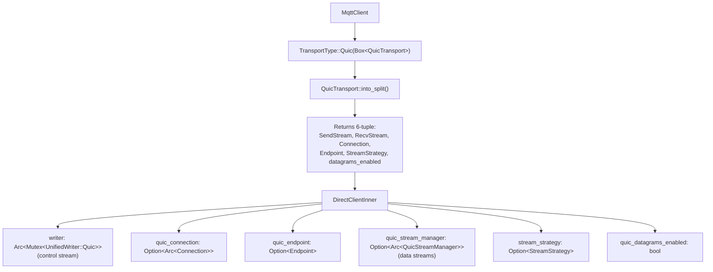
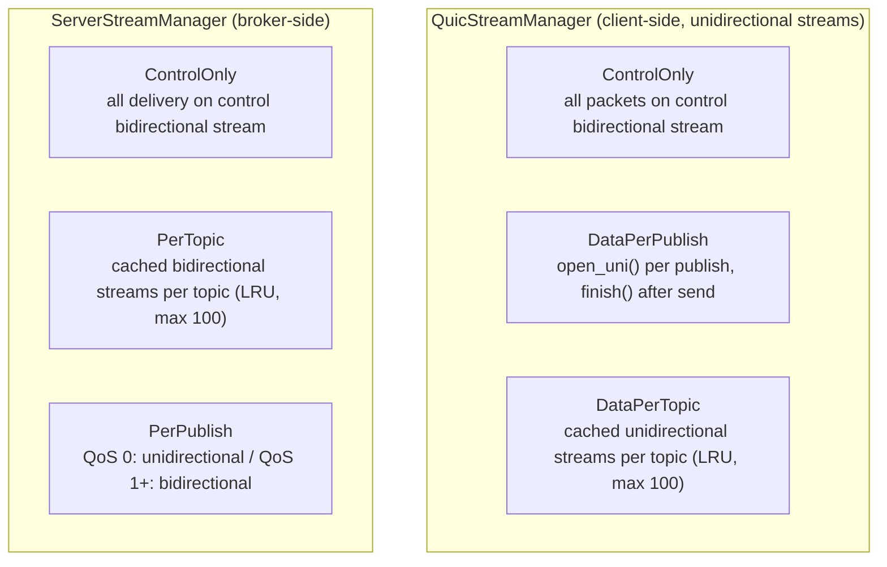

# QUIC Transport Implementation Specification

**Status:** Implementation Complete (Simple Multistreams + Broker + Datagrams + Flow Headers + Connection Migration)
**Last Updated:** 2026-03-15

## Table of Contents

1. [Implementation Status](#implementation-status)
2. [Overview](#overview)
3. [Architecture](#architecture)
4. [Dependencies](#dependencies)
5. [Core Components](#core-components)
6. [Flow Headers](#flow-headers)
7. [Configuration](#configuration)
8. [Error Handling](#error-handling)
9. [Testing Strategy](#testing-strategy)
10. [Performance Considerations](#performance-considerations)

---

## Implementation Status

### Completed Features

| Feature | Status | Notes |
|---------|--------|-------|
| Client QUIC transport | Complete | QuicTransport, QuicConfig |
| Control stream support | Complete | Single bidirectional stream |
| URL parsing (quic://) | Complete | Auto-detection in connect() |
| Certificate verification | Complete | NoVerification + proper verification |
| Simple Multistreams | Complete | ControlOnly, DataPerPublish, DataPerTopic |
| Per-topic stream caching | Complete | LRU eviction in QuicStreamManager |
| Broker QUIC support | Complete | QuicAcceptor, multi-stream handling |
| Server-initiated streams | Complete | ServerStreamManager with per-topic/per-publish delivery |
| Datagram support | Complete | QoS 0 over unreliable QUIC datagrams (RFC 9221) |
| Flow headers | Complete | Encode/decode for types 0x11-0x14, FlowRegistry |
| Connection migration (server) | Complete | Detects via remote_address(), per-IP tracking updated atomically |
| Connection migration (client) | Complete | MqttClient::migrate() with Endpoint::rebind() |

### Key Files

**Client:**
- `crates/mqtt5/src/transport/quic.rs` - QuicTransport, QuicConfig, StreamStrategy, ClientTransportConfig
- `crates/mqtt5/src/transport/quic_stream_manager.rs` - QuicStreamManager with LRU cache and flow header support
- `crates/mqtt5/src/client/direct/mod.rs` - DirectClientInner stores quic_connection, quic_endpoint, quic_stream_manager
- `crates/mqtt5/src/client/direct/unified.rs` - UnifiedReader/UnifiedWriter with Quic variants using quinn types directly

**Broker:**
- `crates/mqtt5/src/broker/quic_acceptor.rs` - QuicAcceptorConfig, connection/stream acceptance, data stream reading with flow headers
- `crates/mqtt5/src/broker/server_stream_manager.rs` - ServerStreamManager for broker-to-client QUIC stream delivery
- `crates/mqtt5/src/broker/config/transport.rs` - ServerDeliveryStrategy, broker QuicConfig

**Flow Headers & State:**
- `crates/mqtt5/src/transport/flow.rs` - RFC 9000 varint, FlowId, FlowFlags, ControlFlowHeader, DataFlowHeader, FlowHeader enum, FlowIdGenerator
- `crates/mqtt5/src/session/quic_flow.rs` - FlowState, FlowLifecycle, FlowType, FlowRegistry

### Known Issues

1. **EMQX Multi-stream:** EMQX only supports Single Stream mode. Our Simple Multistreams implementation is ahead of EMQX. Multi-stream tests timeout because EMQX ignores client-initiated data streams.

### MQTT-over-QUIC Modes (mqtt.ai spec)

| Mode | Description | Our Status | EMQX Status |
|------|-------------|------------|-------------|
| Single Stream | All packets on one bidirectional stream | Supported | Supported |
| Simple Multistreams | Client-initiated streams per topic/publish | Supported | Not supported |
| Advanced Multistreams | Flow headers, persistence, server-initiated | Complete (encoding, registry, flow recovery on reconnect) | Not supported |

---

## Overview

### Goals

Add QUIC transport support to the mqtt5 crate using the quinn library. This approach:

- Reuses existing Transport trait infrastructure
- Minimizes changes to packet I/O and session management
- Uses quinn's SendStream/RecvStream directly (no wrapper types)
- Enables configurable multiplexing strategies
- Supports both client and broker QUIC transport

### Success Criteria

1. Client can connect to QUIC broker using control stream
2. All MQTT operations work (CONNECT/PUBLISH/SUBSCRIBE/etc)
3. QoS 0/1/2 flows work correctly
4. Session persistence works across reconnects
5. Performance comparable to TCP/TLS for single-stream usage
6. Configurable multi-stream strategies (ControlOnly, DataPerPublish, DataPerTopic)
7. Broker accepts QUIC connections with multi-stream handling
8. Datagram support for QoS 0 unreliable delivery
9. Flow header encode/decode for Advanced Multistreams interoperability

---

## Architecture

### Client Transport Architecture



### Multi-Stream Architecture



### Stream Mapping to MQTT Packets

**Control stream (bidirectional):** CONNECT, CONNACK, SUBSCRIBE, SUBACK, UNSUBSCRIBE, UNSUBACK, PINGREQ, PINGRESP, DISCONNECT, AUTH

**Data streams:** PUBLISH packets — client-to-broker uses unidirectional streams; broker-to-client uses bidirectional (PerTopic, PerPublish QoS 1+) or unidirectional (PerPublish QoS 0)

**Datagrams (unreliable):** QoS 0 PUBLISH packets that fit within max datagram size

### Broker Connection Handling

The broker spawns three concurrent tasks per QUIC connection:

1. **Client handler** - processes packets from control stream via `ClientHandler::run()`
2. **Datagram reader** - reads unreliable datagrams, decodes packets, forwards to handler via mpsc channel
3. **Data stream acceptor** - accepts unidirectional streams (`accept_uni`), spawns per-stream readers that parse flow headers and forward packets to handler

Data stream readers detect flow headers by inspecting the first byte (0x11-0x13) and register flows in a per-connection `FlowRegistry`. User-defined flow headers (0x14) are not currently detected.

### Connection Migration

QUIC connection migration allows a client's network address to change (e.g., WiFi to cellular) without re-establishing the MQTT session.

**Server-side detection:** `ClientHandler::check_quic_migration()` runs after each packet in both `handle_packets` and `handle_packets_no_keepalive`. It compares `Connection::remote_address()` against the stored `client_addr`. On mismatch:
1. Updates `self.client_addr` to the new address
2. Logs the migration event with client_id, old address, and new address
3. Calls `ResourceMonitor::update_connection_ip()` which atomically decrements the old IP count and increments the new IP count in a single lock acquisition

**Client-side active migration:** `MqttClient::migrate()` calls `Endpoint::rebind()` with a freshly bound UDP socket (`0.0.0.0:0`). This changes the local address while keeping all QUIC streams and the Connection object valid. Non-QUIC transports return `MqttError::ConnectionError` and disconnected clients return `MqttError::NotConnected`.

**Key files:**
- `crates/mqtt5/src/broker/client_handler/mod.rs` — `check_quic_migration()`
- `crates/mqtt5/src/broker/resource_monitor.rs` — `update_connection_ip()`
- `crates/mqtt5/src/client/direct/mod.rs` — `DirectClientInner::migrate()`
- `crates/mqtt5/src/client/mod.rs` — `MqttClient::migrate()`
- `crates/mqtt5/tests/quic_migration_tests.rs` — 5 integration tests

---

## Dependencies

### Quinn Dependency

The project uses Quinn 0.11.x from crates.io.

### ALPN

Both client and broker set ALPN to `mqtt`.

### TLS Configuration

- Client: configurable via `QuicConfig` with system roots, custom CA certs, client certificates, or `NoVerification`
- Broker: `QuicAcceptorConfig` with server cert/key, optional client CA certs for mutual TLS

---

## Core Components

### 1. StreamStrategy (Client)

**File:** `crates/mqtt5/src/transport/quic.rs`

```rust
pub enum StreamStrategy {
    ControlOnly,       // all packets on control stream (default)
    DataPerPublish,    // new unidirectional stream per PUBLISH
    DataPerTopic,      // cached unidirectional stream per topic
    #[deprecated(note = "architecturally identical to DataPerTopic; use DataPerTopic instead")]
    DataPerSubscription,
}
```

`DataPerSubscription` is deprecated. It is architecturally identical to `DataPerTopic`; use `DataPerTopic` instead.

### 2. ServerDeliveryStrategy (Broker)

**File:** `crates/mqtt5/src/broker/config/transport.rs`

```rust
pub enum ServerDeliveryStrategy {
    ControlOnly,
    #[default]
    PerTopic,
    PerPublish,
}
```

Controls how the broker delivers PUBLISH packets to QUIC clients. Default is `PerTopic`.

### 3. ClientTransportConfig

**File:** `crates/mqtt5/src/transport/quic.rs`

Aggregates client-side QUIC transport settings:

```rust
pub struct ClientTransportConfig {
    pub insecure_tls: bool,
    pub stream_strategy: StreamStrategy,
    pub flow_headers: bool,
    pub flow_expire: Duration,
    pub max_streams: Option<usize>,
    pub datagrams: bool,
    pub connect_timeout: Duration,
}
```

### 4. QuicConfig (Client)

**File:** `crates/mqtt5/src/transport/quic.rs`

Full client connection configuration:

- `addr: SocketAddr` and `server_name: String`
- TLS: `client_cert`, `client_key`, `root_certs`, `use_system_roots`, `verify_server_cert`
- Stream strategy: `stream_strategy: StreamStrategy`
- Concurrent stream limit: `max_concurrent_streams: Option<usize>`
- Datagrams: `enable_datagrams`, `datagram_send_buffer_size`, `datagram_receive_buffer_size` (default 65536)
- Flow headers: `enable_flow_headers`, `flow_expire_interval` (default 300s), `flow_flags: FlowFlags`

Transport parameters set in `build_client_config()`:
- Max idle timeout: 120s
- Stream receive window: 256 KiB
- Connection receive window: 1 MiB
- Send window: 1 MiB
- Datagram buffers configured when `enable_datagrams` is true

### 5. QuicTransport

**File:** `crates/mqtt5/src/transport/quic.rs`

Implements the `Transport` trait. Holds `QuicConfig`, optional `Endpoint`, `Connection`, and control stream `(SendStream, RecvStream)`.

`into_split()` consumes self and returns a 6-tuple:

```rust
pub fn into_split(self) -> Result<(SendStream, RecvStream, Connection, Endpoint, StreamStrategy, bool)>
```

The `Endpoint` is returned so `DirectClientInner` can store it and call `endpoint.wait_idle()` on disconnect, ensuring the CONNECTION_CLOSE frame is transmitted.

Disconnect sequence:
1. `QuicStreamManager::close_all_streams()` finishes all data streams
2. `connection.close(0, b"disconnect")` sends CONNECTION_CLOSE
3. `tokio::spawn(timeout(2s, endpoint.wait_idle()))` waits for draining to complete

No `QuicReadHalf`/`QuicWriteHalf` wrapper types exist. Quinn's `SendStream` and `RecvStream` implement `AsyncRead`/`AsyncWrite` and are used directly.

### 6. QuicStreamManager (Client)

**File:** `crates/mqtt5/src/transport/quic_stream_manager.rs`

Manages client-side data streams. Uses `Arc<Connection>` and `Arc<Mutex<...>>` for interior state.

Key behaviors:
- **DataPerPublish**: `send_packet_on_stream()` opens a unidirectional stream, writes optional flow header + packet, calls `finish()`, then `yield_now()` to allow I/O driver to transmit before returning
- **DataPerTopic**: `send_on_topic_stream()` uses `get_or_create_topic_stream()` which checks cache, evicts idle streams (300s timeout) and performs LRU eviction when exceeding 100 cached streams
- **Flow headers**: when `enable_flow_headers` is true, writes a `DataFlowHeader` (type 0x12) at the beginning of each new data stream
- **Recovery**: `open_recovery_stream()` writes a flow header with custom recovery flags for flow state recovery

### 7. QuicAcceptorConfig (Broker)

**File:** `crates/mqtt5/src/broker/quic_acceptor.rs`

Broker-side QUIC configuration:

- `cert_chain` and `private_key`
- Optional `client_ca_certs` with `require_client_cert` for mutual TLS
- `alpn_protocols` (default: `["mqtt"]`)

Transport parameters in `build_server_config()`:
- Max idle timeout: 60s
- Stream receive window: 256 KiB
- Connection receive window: 1 MiB
- Send window: 1 MiB
- Datagram receive buffer: 64 KiB
- Datagram send buffer: 64 KiB

`QuicStreamWrapper` wraps `(SendStream, RecvStream, SocketAddr)` and implements `AsyncRead`/`AsyncWrite` for the broker's `BrokerTransport::quic()`.

### 8. ServerStreamManager (Broker)

**File:** `crates/mqtt5/src/broker/server_stream_manager.rs`

Manages broker-to-client QUIC stream delivery.

Behaviors by strategy:
- **ControlOnly**: returns error (caller should write to control stream directly)
- **PerTopic**: cached bidirectional streams (`open_bi()`) per topic with LRU eviction (max 100, 300s idle timeout), writes server data flow header (type 0x13) on new streams
- **PerPublish**: QoS 0 uses unidirectional streams (`open_uni()`); QoS 1+ uses bidirectional streams (`open_bi()`), writes flow header, calls `finish()` after write

### 9. UnifiedReader/UnifiedWriter

**File:** `crates/mqtt5/src/client/direct/unified.rs`

Quinn types are used directly in the enum variants:

```rust
enum UnifiedReaderInner {
    Tcp(OwnedReadHalf),
    Tls(TlsReadHalf),
    WebSocket(WebSocketReadHandle),
    Quic(RecvStream),
}

pub enum UnifiedWriter {
    Tcp(OwnedWriteHalf),
    Tls(TlsWriteHalf),
    WebSocket(WebSocketWriteHandle),
    Quic(SendStream),
}
```

`PacketReader` is implemented directly for `RecvStream` (with `protocol_version` parameter for versioned decoding) and `PacketWriter` for `SendStream` in `quic.rs`.

### 10. TransportType

**File:** `crates/mqtt5/src/transport.rs`

```rust
pub enum TransportType {
    Tcp(TcpTransport),
    Tls(Box<TlsTransport>),
    WebSocket(Box<WebSocketTransport>),
    Quic(Box<QuicTransport>),
}
```

---

## Flow Headers

### Overview

Flow headers are written at the beginning of each QUIC data stream to identify flow ownership, persistence flags, and expiry. They follow the mqtt.ai Advanced Multistreams specification.

### Flow Header Types

| Type | Byte | Description |
|------|------|-------------|
| Control Flow | 0x11 | `flow_type(varint) + flow_id(varint)=0x00 + flags(u8)` |
| Client Data Flow | 0x12 | `flow_type(varint) + flow_id(varint) + expire_interval(varint) + flags(u8)` |
| Server Data Flow | 0x13 | `flow_type(varint) + flow_id(varint) + expire_interval(varint) + flags(u8)` |
| User-Defined | 0x14 | `flow_type(varint) + application_data` |

### Variable-Length Integers

Uses RFC 9000 encoding (2-bit length prefix), distinct from MQTT's variable-length integer format:

| Range | Bytes | Prefix |
|-------|-------|--------|
| 0-63 | 1 | 0b00 |
| 64-16383 | 2 | 0b01 |
| 16384-1073741823 | 4 | 0b10 |
| 1073741824-4611686018427387903 | 8 | 0b11 |

### FlowId

`FlowId(u64)` with LSB ownership bit:
- LSB = 0: client-initiated flow
- LSB = 1: server-initiated flow
- `sequence()` returns `raw >> 1`

`FlowIdGenerator` maintains separate counters for client and server flow IDs, starting at 1.

### FlowFlags (8-bit bitfield)

| Bit | Field | Description |
|-----|-------|-------------|
| 0 | `clean` | Discard previous persistent flow states |
| 1 | `abort_if_no_state` | Mandate peer abort if state unavailable |
| 2-3 | `err_tolerance` | 2-bit error tolerance level (0-3) |
| 4 | `persistent_qos` | Preserve QoS delivery states |
| 5 | `persistent_topic_alias` | Maintain topic alias mappings |
| 6 | `persistent_subscriptions` | Retain subscription data (client flows only) |
| 7 | `optional_headers` | Indicates optional headers present |

Encoded/decoded via the `bebytes` crate's `BeBytes` derive macro.

### FlowRegistry

**File:** `crates/mqtt5/src/session/quic_flow.rs`

Per-connection flow state management on the broker side:

- `FlowRegistry` stores up to `max_flows` (default 256) `FlowState` entries keyed by `FlowId`
- `FlowState` tracks: `FlowType`, `FlowFlags`, `expire_interval`, `created_at`, `last_activity`, subscriptions, topic aliases, pending packet IDs, `FlowLifecycle` (Idle/Open/HalfClosed/Closed), and optional `stream_id`
- Broker data stream readers call `try_read_flow_header()` which peeks the first byte to detect flow headers, parses them, and registers the flow

### Implementation Status

| Component | Status |
|-----------|--------|
| RFC 9000 varint encode/decode | Complete |
| FlowId with ownership bit | Complete |
| FlowFlags encode/decode | Complete |
| ControlFlowHeader (0x11) | Complete |
| DataFlowHeader (0x12, 0x13) | Complete |
| FlowHeader enum dispatch | Complete |
| FlowIdGenerator | Complete |
| FlowRegistry | Complete |
| Client-side flow header writing | Complete (QuicStreamManager) |
| Broker-side flow header parsing | Complete (quic_acceptor data stream reader) |
| Server-side flow header writing | Complete (ServerStreamManager) |
| Flow recovery on reconnection | Complete |
| Datagram support for QoS 0 | Complete |

---

## Configuration

### Client Usage

```rust
use mqtt5::transport::quic::{QuicConfig, StreamStrategy};

let config = QuicConfig::new(
    "127.0.0.1:14567".parse()?,
    "localhost",
)
.with_verify_server_cert(false)
.with_stream_strategy(StreamStrategy::DataPerTopic)
.with_datagrams(true)
.with_flow_headers(true)
.with_flow_expire_interval(600);
```

### URL-Based Connection

```rust
client.connect("quic://broker.example.com:14567", options).await?;
client.connect("quics://broker.example.com:14567", options).await?;
```

### Broker QUIC Listener

The broker's `QuicAcceptorConfig` is built from TLS cert/key files:

```rust
let config = QuicAcceptorConfig::new(cert_chain, private_key)
    .with_client_ca_certs(ca_certs)
    .with_require_client_cert(true)
    .with_alpn_protocols(vec![b"mqtt".to_vec()]);
```

---

## Error Handling

Quinn errors are mapped to `MqttError` variants via string formatting in each call site. The primary mappings:

| Condition | MqttError |
|-----------|-----------|
| `tokio::time::timeout` expires during connect | `MqttError::Timeout` |
| `RecvStream::read()` returns `None` (end-of-stream) | `MqttError::ClientClosed` |
| `ConnectionError` variants | `MqttError::ConnectionError(format!(...))` |
| `WriteError` variants | `MqttError::ConnectionError(format!(...))` |
| Stream open failures | `MqttError::ConnectionError(format!(...))` |
| Already connected | `MqttError::AlreadyConnected` |
| Flow header parse failure | `MqttError::ProtocolError(...)` |

---

## Testing Strategy

### Unit Tests

- `quic.rs`: QuicConfig builder, transport creation, defaults, datagram config, flow header config
- `quic_stream_manager.rs`: StreamStrategy variants, FlowFlags config, FlowIdGenerator sequence
- `flow.rs`: varint encode/decode (1/2/4/8 byte), FlowId client/server, FlowFlags roundtrip, ControlFlowHeader roundtrip, DataFlowHeader roundtrip, FlowHeader enum dispatch, FlowIdGenerator sequence
- `quic_acceptor.rs`: QuicAcceptorConfig construction

### Integration Tests

**Against our broker (`quic_integration.rs`):**
- test_quic_basic_connection
- test_quic_basic_pubsub
- test_quic_qos0_fire_and_forget
- test_quic_qos1_at_least_once
- test_quic_qos2_exactly_once
- test_quic_control_only_strategy
- test_quic_data_per_publish_strategy
- test_quic_data_per_topic_strategy
- test_quic_data_per_subscription_strategy
- test_quic_concurrent_publishes
- test_quic_large_message
- test_quic_reconnect

**Connection migration (`quic_migration_tests.rs`):**
- test_quic_migration_detected_by_server — captures tracing output, verifies server logs migration event
- test_quic_migration_qos1_survives — QoS 1 publish/ack works across migration boundary
- test_quic_multiple_migrations — 3 sequential migrations, all messages delivered
- test_migrate_non_quic_returns_error — TCP client gets error mentioning "QUIC"
- test_migrate_not_connected_returns_error — disconnected client gets `NotConnected`

---

## Performance Considerations

### Transport Parameters

| Parameter | Client | Broker |
|-----------|--------|--------|
| Max idle timeout | 120s | 60s |
| Stream receive window | 256 KiB | 256 KiB |
| Connection receive window | 1 MiB | 1 MiB |
| Send window | 1 MiB | 1 MiB |
| Datagram send buffer | 64 KiB (configurable) | 64 KiB |
| Datagram receive buffer | 64 KiB (configurable) | 64 KiB |

### Stream Lifecycle

- **DataPerPublish (client):** open_uni -> write flow header -> write packet -> finish() -> yield_now(). The yield ensures the I/O driver transmits stream frames before the caller proceeds, preventing disconnect() from racing against pending writes.
- **DataPerTopic (client/broker):** Cached in HashMap with 300s idle timeout and LRU eviction at 100 streams. Streams are finished on eviction.
- **Control stream:** Persists for connection lifetime. Only closed on disconnect.

### Disconnect Draining

On client disconnect, `conn.close()` is called followed by a background `timeout(2s, endpoint.wait_idle())`. This adapts to actual RTT: completes fast at low latency, waits longer at high latency. A fixed sleep would race against Quinn's draining period (3x PTO).

---

## References

- [Quinn documentation](https://docs.rs/quinn/0.11.9/quinn/)
- [QUIC RFC 9000](https://www.rfc-editor.org/rfc/rfc9000.html)
- [RFC 9221 - Unreliable Datagrams](https://datatracker.ietf.org/doc/html/rfc9221)
- [EMQX QUIC documentation](https://www.emqx.io/docs/en/v5.0/mqtt-over-quic/introduction.html)
- [mqtt.ai MQTT-next specification](https://mqtt.ai/mqtt-next/)
